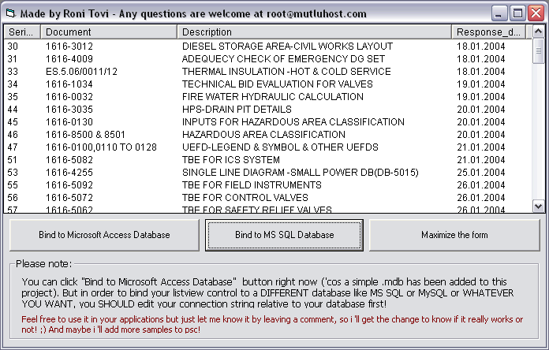

<div align="center">

## Bind Listview control to \*ANY\* database you want\! \(Access, MSSQL, MySQL etc\.\.\)


</div>

### Description

This code simply binds a ListView control to *ANY* kind of database you want(Access, MSSQL, MySQL etc...)

It also includes auto column resizing that resizes column headers relative to their content.
 
### More Info
 


<span>             |<span>
---                |---
**Submitted On**   |2006-02-23 04:30:56
**By**             |[Roni Tovi](https://github.com/Planet-Source-Code/PSCIndex/blob/master/ByAuthor/roni-tovi.md)
**Level**          |Advanced
**User Rating**    |4.2 (38 globes from 9 users)
**Compatibility**  |VB 6\.0
**Category**       |[Databases/ Data Access/ DAO/ ADO](https://github.com/Planet-Source-Code/PSCIndex/blob/master/ByCategory/databases-data-access-dao-ado__1-6.md)
**World**          |[Visual Basic](https://github.com/Planet-Source-Code/PSCIndex/blob/master/ByWorld/visual-basic.md)
**Archive File**   |[Bind\_Listv1975532222006\.zip](https://github.com/Planet-Source-Code/roni-tovi-bind-listview-control-to-any-database-you-want-access-mssql-mysql-etc__1-64418/archive/master.zip)

### API Declarations

```
Declare Function SendMessage Lib "user32" Alias "SendMessageA" (ByVal hwnd As Long, ByVal wMsg As Long, ByVal wParam As Long, lParam As Any) As Long
```


